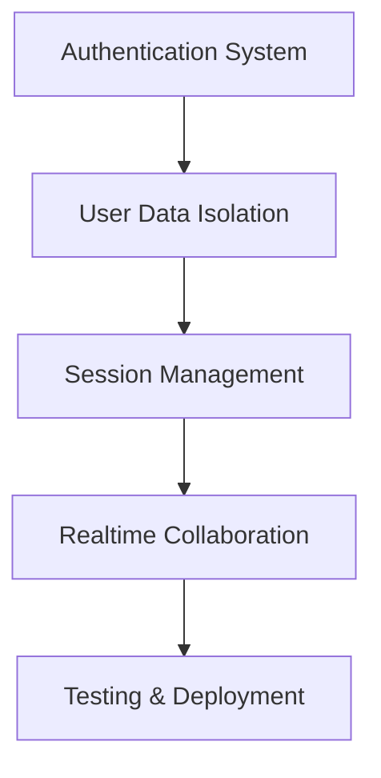

# Kuriplot Application Architecture Plan

This document outlines the architecture plan for implementing login functionalities and realtime collaboration features in the kuriplot application.

## 1. User Authentication System

### 1.1. Authentication Methods
- Traditional username/password authentication
- Third-party authentication (Google, GitHub)
- JWT-based authentication with refresh tokens

### 11.2. Backend Implementation
- Add User entity with fields:
  - id (primary key)
  - username
  - email
  - password (hashed)
  - provider (local, google, github)
  - providerId (for third-party auth)
  - createdAt
  - updatedAt

- Create AuthController with endpoints:
  - POST /auth/register (username/password registration)
  - POST /auth/login (username/password login)
  - POST /auth/refresh (refresh token)
  - GET /auth/google (Google OAuth initiation)
  - GET /auth/google/callback (Google OAuth callback)
  - GET /auth/github (GitHub OAuth initiation)
  - GET /auth/github/callback (GitHub OAuth callback)

- Implement AuthService with methods:
  - register (create new user with hashed password)
  - validateUser (check username/password)
  - generateTokens (JWT access and refresh tokens)
  - verifyToken (verify JWT token)

### 1.3. Frontend Implementation
- Create login/signup pages
- Implement OAuth flows for Google/GitHub
- Store JWT tokens in localStorage/cookies
- Add authentication context/provider for React components

## 2. Realtime Collaboration Features

### 2.1. WebSocket Implementation
- Use NestJS WebSocket Gateway for real-time communication
- Implement rooms for shared curriculum plans
- Broadcast changes to all connected clients in a room

### 2.2. Collaborative Actions
- Real-time course dragging between semesters
- Real-time editing of course details
- Real-time addition/removal of courses
- Real-time updates to course properties (position, semester, etc.)

### 2.3. Conflict Resolution
- Implement operational transformation or CRDTs for conflict resolution
- Use timestamps to determine the order of operations
- Handle simultaneous edits gracefully

### 2.4. Backend Implementation
- Create WebSocket gateway with events:
  - joinRoom (user joins a curriculum plan)
  - leaveRoom (user leaves a curriculum plan)
  - courseMoved (course dragged to new position)
  - courseUpdated (course details edited)
  - courseAdded (new course created)
  - courseDeleted (course removed)
  - userJoined (notify others when user joins)
  - userLeft (notify others when user leaves)

### 2.5. Frontend Implementation
- Establish WebSocket connection on component mount
- Listen for real-time events and update UI accordingly
- Emit events when user performs collaborative actions
- Show presence indicators for other connected users

## 3. User-Specific Data Isolation

### 3.1. Data Model
- Each user has their own curriculum plans
- Shared plans with permission levels (owner, editor, viewer)
- Plan permissions stored in a separate entity:
  - planId
  - userId
  - permissionLevel (owner, edit, view)

### 3.2. Access Control
- Implement middleware to check user permissions
- Validate access before allowing CRUD operations on plans
- Filter data based on user's permission level

### 3.3. Backend Implementation
- Modify Course entity to include userId and planId
- Create Plan entity with fields:
  - id (primary key)
  - name
  - ownerId
  - createdAt
  - updatedAt

- Create PlanPermission entity with fields:
  - id (primary key)
  - planId
  - userId
  - permissionLevel (enum: owner, edit, view)

- Update CourseService to filter by userId/planId
- Create PlanService to manage plan CRUD operations
- Create PlanPermissionService to manage sharing

### 3.4. Frontend Implementation
- Display user's plans in a dashboard
- Allow users to create new plans
- Implement sharing functionality with permission selection
- Show shared plans based on permission level

## 4. Session Management

### 4.1. Token-Based Authentication
- JWT access tokens with short expiration (15-30 minutes)
- Refresh tokens with longer expiration (7 days)
- HttpOnly, secure cookies for refresh tokens

### 4.2. Session Storage
- Store active sessions in database for revocation capability
- Include session metadata (IP, user agent, login time)
- Allow users to view and revoke active sessions

### 4.3. Backend Implementation
- Create Session entity with fields:
  - id (primary key)
  - userId
  - refreshTokenHash
  - ip
  - userAgent
  - createdAt
  - expiresAt

- Implement session middleware to validate tokens
- Add endpoints for session management:
  - GET /auth/sessions (list active sessions)
  - DELETE /auth/sessions/:id (revoke specific session)
  - DELETE /auth/sessions (revoke all sessions)

### 4.4. Frontend Implementation
- Automatically refresh access tokens when expired
- Redirect to login when refresh token is invalid
- Provide UI for users to manage active sessions

## 5. Implementation Roadmap

### 5.1. Phase 1: Authentication System
- Implement User entity and database migrations
- Create AuthController and AuthService
- Develop frontend login/signup pages
- Implement JWT token handling

### 5.2. Phase 2: User Data Isolation
- Create Plan and PlanPermission entities
- Implement access control middleware
- Update CourseService to filter by user/plan
- Develop frontend dashboard for plan management

### 5.3. Phase 3: Session Management
- Implement Session entity
- Add session validation middleware
- Create session management endpoints
- Develop frontend session management UI

### 5.4. Phase 4: Realtime Collaboration
- Implement WebSocket gateway
- Add real-time events for collaborative actions
- Implement conflict resolution mechanisms
- Develop frontend WebSocket integration

## 6. Security Considerations

- Password hashing with bcrypt
- JWT token signing with secure secrets
- Input validation and sanitization
- Rate limiting for authentication endpoints
- CORS configuration for frontend-backend communication
- Secure WebSocket connections (wss:// in production)

## 7. Scalability Considerations

- Use Redis for WebSocket session storage
- Implement database connection pooling
- Consider load balancing for multiple server instances
- Use CDN for static assets
- Implement caching for frequently accessed data